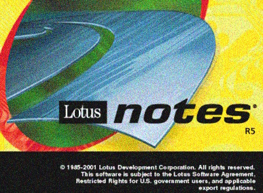
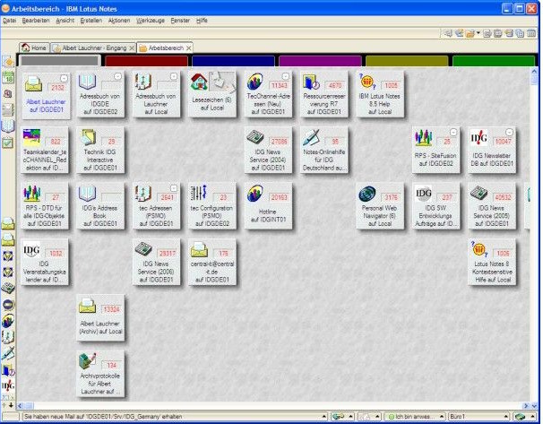

<table><tr><td>

#### `Lotus Notes` (henceforth also `LN`), the multiplatform groupware, was first released at the turn of 1991. 

Joining the best of computer sciences from the 1980s with _laissez-faire_ IT in the 1990s, it rapidly became the core asset for companies and teams.

</td><td width="30%">
<picture></picture>
</td><td>

Those who programmed and administered will reminisce about genuine Rapid Application Development with fluent installation/evaluation🙋 and leading-edge editors.

🙋 <samp>I can't feature a newbie installing SharePoint on a notebook and writing the first useful application within a week.</samp>

</td></tr></table>

<h1 align="center">"<i>This used to be my playground</i>"</h1>

As a developer of Line-of-Business and corporate applications on Lotus Notes for over a decade (<samp>before I cast my lot with <a href="../../../../../.net">C#.NET</a>.</samp>),
 
I must have deserved the privilege of personal <b><i>LOTUS</i> NOTES</b>.

### IBM PC users remember (or not) that it was a time and a <b>word</b> &thinsp;&mdash;&thinsp; neither Microsoft's one nor WordPerfect, but  «<mark>&thinsp;L<samp>&thinsp;O&thinsp;T&thinsp;U&thinsp;S&thinsp;</samp></mark>» &thinsp;&mdash;&thinsp; a synonym for spreadsheet, text processor, calendar, E-Mail client, and collaboration tools.

<table><tr><td width="30%"><picture></picture>
</td><td>

**LN** paved the public road to diverse innovations: client-server, multirole/group access, distributed/synchronized doc-oriented DB📜, **replication**⭐, asymmetric encryption from authorization down to selected fields on demand &thinsp;&mdash;&thinsp; to name a few hallmarks.

**LN** wasn't deprived of drawbacks; there were alternative suites (including legacy and tailor-made), but this aquatic flower dominated the market garden ... until Microsoft began to win large chunks of the office software market.\
___________\
&nbsp; 📜 <samp>Long before NoSQL became mainstream.</samp>\
&nbsp; ⭐ <samp>Emphasized for superior ease, versatility, productivity, and robustness. Besides synchronizing DBs it allowed us to seamlessly use/develop LN offline, guarantee messaging, and merge design much simpler than in Git or TFS.</samp>
</td></tr></table>

* In **1995**,  gained Lotus in full💰.\
It was a big chance not only to gain from sales and internal installations but also to reform leastways _Notes_ by leaning on the influence and technological capital of the _Big Blue_.\
However, mediocre and inaccurately focused efforts caused Lotus to wilt.🍦

* In **2001**,  released its "bird of a feather" &thinsp;<samp>&mdash;</samp>&thinsp; **SharePoint** &thinsp;<samp>&mdash;</samp>&thinsp; much more sophisticated and bulkier but promoting the next generation of a product and API.\
SharePoint was deprived of many inherent vices of the Lotus trailblazer and gradually began to supersede _LN_ in the one-way migration. 

* In **2018**, the sell-out of Domino/Notes and granting the office's source code to freeware pushed **_LN_** out to IT margins.

___________\
&nbsp; &nbsp; 💰 <samp>For a $3.5 billion &mdash; pretty good deal ahead of skyrocketing procurements of the 2000s.</samp>\
&nbsp; &nbsp; 🍦 <samp>It's not a top secret that IBM's cold shoulder urged many top Lotus contributors to leave.</samp>

<h2 align="center">Epilogue. Alternate history</h2>

> ### _Lotus Domino/Notes_ had enough outdated and weak facets to surrender to the rival from Redmond (WA), but let's dream up what the "surviving" **LN** would be.

### 💿 Storage as a sound object-relational model over IBM DB2

Notes Storage Facility (NSF) was enclosed and restrained. For example, unavailable foreign keys required "amateurish" boilerplate for document relations (as references or hierarchies). 

There was a never-realized plan to put DB2 under LN storage, akin to MS SQL behind SharePoint. 

### ☕ Replacement of `LotusScript`

Lotus developers _nolens volens_ coded in the out-of-date and too elementary _LotusScript_ &thinsp;&mdash;&thinsp; a branch of Visual Basic with built-in LN API (resting on `C++` API). 

`Java` could be promoted to a primary language, but its API with a lagging version remained limited, poorly documented, and tricky (e.g., know to call the garbage collector in a cycle of LN docs.).

Even a greater option would be creating an object-oriented flavor of `JavaScript` for both front-end (to replace also `@formula`) and back-end (LN applications weren't exceedingly demanding for performance and semantics).

### 🌩️ Web-browser as the only user client

Although Notes Server could render applications on HTTP since 1996, designing forms required much fine-tuning with HTML/JS. **XPages** (since R8.5) came too late and were half-hearted.

The solution would be to eliminate desktop premises and replace them with a web solution akin to Angular or React. 

### 📎 Seamless UI integration of office parts

_Lotus 1-2-3_ and _Word Pro_ were already outmoded in 2000 (IBM generously paid Microsoft for its _Office_ licenses). LN could integrate better editors/viewers with storage in popular open formats.

### 🏬 Resources

The difference between IBM's "_search for_" and Microsoft's "_select from_" learning materials was notorious. Enough to say.

_Lotus Notes_ wasn't significantly known for things not out-of-the-box, even migrated to [IBM Eclipse](https://en.wikipedia.org/wiki/Eclipse_(software))<b>W</b>. However, third-party or custom utils, UX elements, and environment extensions must have been its rich part.
 
Great potential for [FOSS](https://en.wikipedia.org/wiki/Free_and_open-source_software)<b>W</b> contributions in Lotus products was never claimed.

### 🙋 Last but not least

This wishlist and quality sustainability would require top and liable teams/community instead of outsourcing. 
("Migrating" myself from _LN_ to .NET, I experienced, for certain, that beta versions of Visual Studio&nbsp;2010 were less eager to crash than sametime releases of Notes Designer.)

<h2 align="center">⬆️ <mark>Was it technically doable? &thinsp;&mdash;&thinsp; <b>Absolutely</b>.</mark> <samp>Great cutting-edge again? &thinsp;&mdash;&thinsp; Possibly.</samp></h2>

> Let me finish with the quote from another single: "_**Now I know what made Lotus blue**_."\
> (Yes, I know &mdash; **_Otis_** but, in earnest, I was pretty sure that _Lotus_ until [proof](https://en.wikipedia.org/wiki/Now_I_Know_What_Made_Otis_Blue)&thinsp;<b>W</b>. This should suffice to demonstrate my involvement.)

______\
🔚 &nbsp;🌘 <samp><b>Β</b>ytesHausMeister</samp> ..2023-2026..
