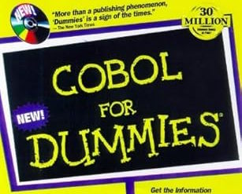
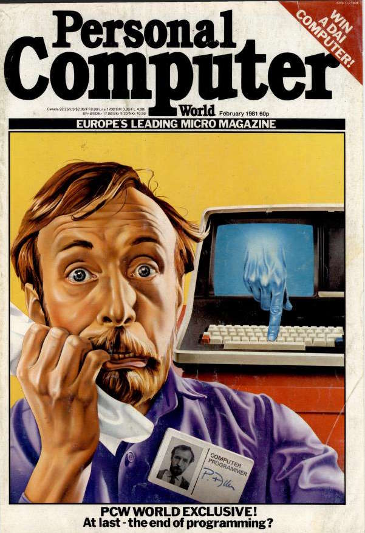
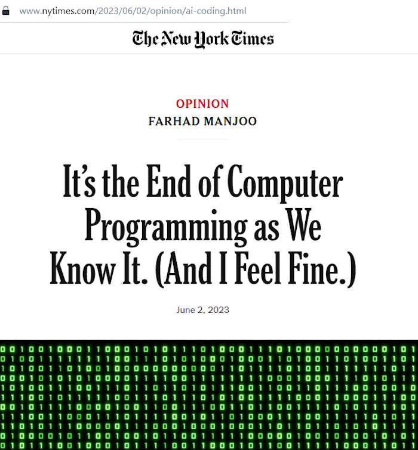
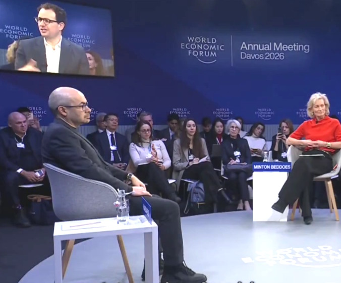

<h1 align="center">Calendar &nbsp;&mdash;&nbsp; Nerds' Doomsdays</h1>

<table><tr valign="top" align="center">
  <td width="33%">

 # 1959

### <mark>CO</mark>mmon <mark>B</mark>usiness-<mark>O</mark>riented <mark>L</mark>anguage &ndash; deabbreviation reveals that COBOL was intended for non-programmers to describe their tasks in English.

(It never happened.)
  </td>
 <td width="34%"><h1>1981</h1></td>
 
</tr><tr></tr><tr valign="top">
 <td><h1>1 Jan 2023</h1><h3>COMMUNICATIONS of the ACM</h3><h4>The End of Programming</h4>
  </td>
 <td><h1>June 2023</h1>
</td>
 <td>
  
# January 2026

### "We might be 6 to 12 months away from when the model is doing most, maybe all of what SWEs do end-to-end."

</td>
</tr> </table>

___________\
<samp>.. to be continued ..</samp>
