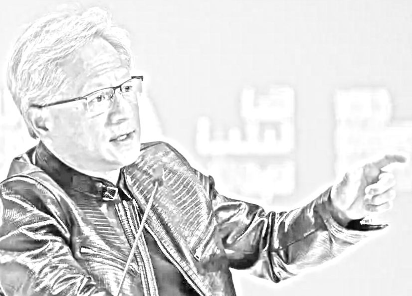

<h1 align="center">Calendar &nbsp;&mdash;&nbsp; Nerds' Doomsdays</h1>

<table><tr valign="top" align="center">
  <td width="33%">

 # 1959

### <mark>CO</mark>mmon <mark>B</mark>usiness-<mark>O</mark>riented <mark>L</mark>anguage &ndash; deabbreviation reveals that COBOL was intended for non-programmers to describe their tasks in English.

(It never happened.)
  </td>
 <td width="34%"><h1>1981</h1></td>
 
</tr><tr></tr><tr valign="top">
 <td>
   
# January 2023

### COMMUNICATIONS of the ACM

### The End of Programming

  </td>
 <td><h1>June 2023</h1>
</td>
<td>
  
# February 2024

<picture></picture>

### «Everybody in the world is now a programmer...

**... This is the miracle of AI. For the very first time, the technology divide has been <mark>completely</mark> closed.»**
</td>
</tr><tr></tr><tr>
  <td>
  
# January 2026

<picture></picture>

### "We might be 6 to 12 months away from when the model is doing most, maybe all of what SWEs do end-to-end."

</td>
<td>
  
</td>
<td>.. PLACEHOLDER FOR THE NEXT WIZARD ..</td>
</tr></table>

___________\
<samp>.. to be continued ..</samp>
