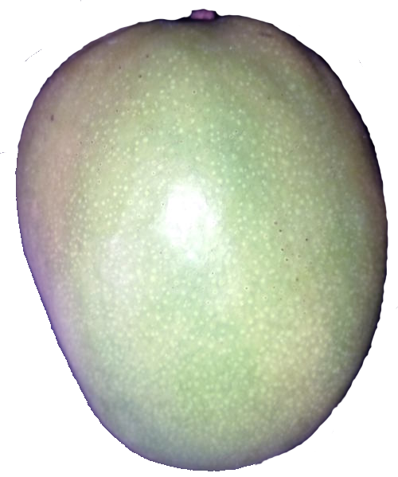

<picture><image alt="&nbsp;AI free" src="../_rsc/_img/illus/AiFree/AI-free_900px.png" /></picture>

<h1 align="center">✒️P<samp>EN</samp> 🙴 B<samp>RUSH</samp>🎨 Craft in IT and Engineering

<table align="center"><tr></tr><tr><td>

### [__Documentation__](README+/tech_docu.md) and [__authoring__](README+/tech-authoring.md) (with their derivatives as audio and video) are two very dissimilar employments of depicting skills with opposing values of formalism, creativity, envisaging, and styling.

</td></tr></table>

The principled distinction is __*driven*__ vs __*drives*__:

* <mark>**Documentation**</mark> is **on-demand**/request derivative of a product or service, must follow templates, and shall be (auto-)generated and reused as much as possible.📖\
&nbsp; &nbsp; &nbsp; &nbsp;📖 <samp>A strict _User manual_ of hazardous tools is an exemplary story.</samp>\
&nbsp; &nbsp; &nbsp; &nbsp; &nbsp; &nbsp; <samp>Microsoft [documentation](https://learn.microsoft.com/) follows this line but, honestly, this doesn't help to "🪟<b>Learn</b>".</samp>

* <mark>**Authoring**</mark> is **initiative**, must take a bird's view of the subject, inspire and explain sophisticated and regulated ideas in an abstractive, friendly, and sometimes informal/playful manner.

<ins>**Documentation**</ins> assumes defined, if not available, subjects (as software applications), while <ins>**authoring**</ins> may begin with a pure idea. (Enough technical _oeuvres_, such as concepts of relational DBs or REST, were based on "paper" concepts with little or no implementation.)

When it's often a reader's headache to find and study the right <mark>documentation</mark> in any state and grade, with <mark>authoring</mark>, it's a burden for "pensters" to attract the public. 

Sticking to the narrowed vocabulary, repetitions, and cliches are benefactors in <mark>documentation</mark> **but** <mark>authoring</mark> sins.

___________

Regardless of the mission, significant writing and good illustration are **expensive** and **exhausting** exercises. If not a hobby or bondage, they must:

&nbsp; &nbsp;✅&thinsp;have a live, eager **auditorium**,\
&nbsp; &nbsp;✅&thinsp;exceed other ways of **teaching**,\
(consider quickly sketched presentation, captured video tutorial, or even watercooler talks)\
&nbsp; &nbsp;✅&thinsp;be **long-term** (corrected, updated, and evolved).

## Vital side effects / Windfall

<table><tr><td><picture></picture></td><td>

Documenting/sketching ideas for even small features mitigates **the impedance between the stretch of imagination and the reality of implementation.**

Namely, formalization and structuring compel us to reexamine and refine concepts, enhance the positive aspects, rectify the negative, and discard unrealistic or meaningless features. 
  
</td></tr></table>

## Appendix. Personal disclaimer

<table><tr valign="top">
<td>
 
  «The difficulty of writing <b>English</b> is most tiresome to me.» 
<i>Charles Dickens</i>, 1850 [and me, XXI]

### The writings and collections here are ...

* The subject of **private** taste, inclination, vision, and fallacies. It's up to you to look them over or recoil in distaste.
* The subject of **continuous** delivery (i.e., endless edit and modification).\
<code>// <i>Nevertheless, it's not all blurred &thinsp;&mdash;&thinsp; most articles are complete.</i></code>
* Few opuses may be in the badly readable state of 🚧<samp><b>draft</b></samp>🐝\
<code>// <i>Skip them while I do my best to finish</i>.</code>

</td><td><picture></picture></td>
</tr></table>

\___________\
🔚 🌘 2023-2025 &rArr; 📂[README+](README+)
