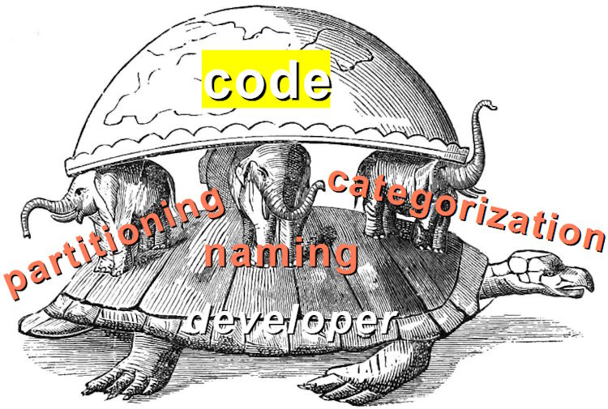
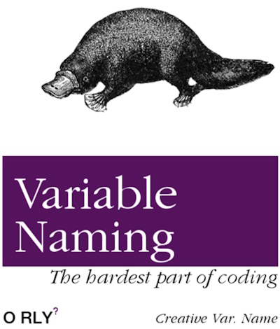

<h4 dir="rtl"><i>«&thinsp;.&thinsp;.&thinsp;.&nbsp;&thinsp;In the beginning was the Word</i>&thinsp;»&thinsp;</h4>

<h1><code>Code</code> organization</h1>

<table><tr valign="top"><td width="50%"><picture></picture></td><td>
  
### Denomination of titles _and_ their classification (that imply domain partitioning) is a pivotal but underrated activity <ins>in&nbsp;every&nbsp;exploration</ins>.
  
#### In software, names with categories, which smoothly guide developers through the design and make development intuitive, are often taken for granted.

<b>O&thinsp;t&thinsp;h&thinsp;e&thinsp;r&thinsp;w&thinsp;i&thinsp;s&thinsp;e</b>

#### one wading through the thorns of pathetic names, code labyrinthine (or flats), and abatis of documents will curse complexity, learning curve, technologies, and fate, but at last the naming.
</td></tr></table>

## 🐘 Categorization

### _Categorisation_ (aka _classification_) is more profound than breaking collocations with sentences, and building the folder hierarchy &thinsp;&mdash;&thinsp; **it&nbsp;frames abstractions.**

If enthusiasts with magnifying glasses could logically group swarms of wretched boulders in far space and paltry insects, it wouldn't be such a burden for unique by-nature software entities.

The challenge is to lay out accurately. Our imagination tries to mnemonically align doubtful and even bizarre names to the right meanings and aliases, but takes on trust their structure.

___________\
As a negative experience, GitHub is full of shallow folders and huge lists, even for corporate projects. Namespaces of frameworks and languages may look like a verbal dump.

### Tags

The only limitation of categorization is the strict tree graph. Tags may rationally dissolve it, though frameworks and IDEs provide limited support for them.

## How to name &thinsp;.&thinsp;.&thinsp;.

<table><tr></tr><tr><td>AS USUAL</td><td /><td align="center"><b><samp>AS CRUCIAL ...</samp></b></td></tr><tr>
<td>

### The prevalent naming is a derivative of the development, which

❌ rests on programmatic "false-domain" made of `Helper.Get(..)`, `Utils.Do(...)`, `Service.Find(...)`, and other supports,\
❌ leaves "construction waste" of temporary names, placeholders,\
❌ spreads umbrella terms and horizontally swelling folders,\
❌ spawns long names and shallow categories (`AddTableReservationInRestaurant(..)`),\
❌ interferes with existing domain and programming naming,\
❌ contains jargon and slang, or terms, dubious in other tongues or cultures. 
  
</td>
<td width="25%"></td>
  <td>

  
</td></tr></table>

The naming of libraries, packages (assemblies), folders, classes, methods/functions, and even non-public _vars_ must be a **№1** challenge and involve the whole team:family: in discussions. 

The inevitable and heavy expenses will pay off with the formation of ***lingua franca*** throughout the team and project, along with&nbsp;...
  
+ shared comprehension of a **domain**, which binds teams,
+ genuine **design** and self-descriptive code,
+ inspiration for <mark>driven design</mark>,
+ base for writing and reading the **documentation**📒,
+ less tension to get into a project <mark>for newcomers</mark>,
+ comfy **navigation** in the source code (beginning from <kbd>CTRL+F</kbd>).

&nbsp;&nbsp;&nbsp;&nbsp;&nbsp;&nbsp;:family: The team means not only developers and managers but customers, testers, and end users.\
&nbsp;&nbsp;&nbsp;&nbsp;&nbsp;&nbsp;📒 reqs/specs, DoU, meetings protocols, and primers - hard to follow but easy to misunderstand or forget

It's an ingredient of successful [domain-driven design](../drive/README.md#Domain-drive) (and vice versa).

## What's next

[Practice](README+/naming_practice.md)

/// _to be continued..._

## Wrapping up

+ Even top consonant teams under time pressure and brakes on perfectionism would rarely be proud of their naming implementation. 
+ The naming (akin to [code quality](../../QA/code_quality/README.md)) will never be perfect, but efforts to improve it must be honest and continuous.

## Appendix. Learning from others

## Hall of Fame

🥇 Historical S[E]QL commands.\
🏆 _Bread crumbling_ for navigation &thinsp;&mdash;&thinsp; win for both the idea and name

\___________\
Audience choice Price goes to Mrs. [Grace Hopper](../../../../pencraft/README+/quotes/README+/contributors/README.md#Grace-Hopper) 
who suggested tongue (English) semantics for programming (so natural now that one can't estimate).

 ...  _TO BE CONTINUED_ ...

## Legacy

🚧 ... to list ... 🚧

## World of ambiguity

### "Generals"

As programming evolved, a mass of general terms had to be given. Some, as `object` or `bug`, are relatively univocal hits &mdash; others shade higher-level notions or interfere with them:

Application, solution, interface, exception - to name a few.

### Bug or Fix?

Tickets titled _Bug_ mean not their introduction but the repair.

### <samp>Exception</samp> or Error ?

Many languages (`C#` there) use this term for errors to throw, though its meaning can sound even opposite &thinsp;&mdash;&thinsp; allowance.

## Curtain of grace (opened)

👑 And the winner is ... `dirty` in miscellaneous languages and APIs as the trait of a modified object.

SQL COALESCE is nothing but `FirstNotNull`

🍅 🍓 

🍓 
🪱 longness

- 'Emoji' defines pictograms overall, while being only a subset. 
- "Icons" are .. eh .. a bit blasphemous.

🗼"Tower of Babel" award for naming in different alphabets. (Unless it's a highly localized domain or business.)

_First-class citizens_ for functions or other techniques have a discrimination flair ...

___________\
🔚 ..  🌙 ... 2024-2026..  📂[README+](README+)\
`// The collage uses the Hindu version of World Elephants.`
