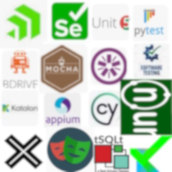

# Software &nbsp;&mdash;&nbsp; Prog<samp>[</samp>rammed/rammatic<samp>]</samp> Tests

<table><tr valign="top"><td><picture></picture>
</td><td>
  
### Coded tests, as a discipline and an idea💡, appeared together with high-level languages.
  
+ They became a unique part of the software: optional but integral.
+ They don't contribute to product contents but are as essential as the foundation code.
+ They are versatile since they can be applied to any extent and direction and for differing purposes.
+ They can follow any practices and methodologies, even &thinsp;&mdash;&thinsp; no tests at all💫.

.The <b>idea</b> of writing procedures with the single objective to examine another code💡

Some algorithms or particular artifacts can be hardly testable or be fruitless. Or only personal evaluation💫

</td></tr></table>

> [!IMPORTANT]  
> **_Prog tests_ aren't the synonym of the <i>automated</i>❗ And vice versa.** (Albeit the overlap is big.)
> 
> Test-driven design doesn't require automation as well as debugging routines. Automated tests may imply hardware and even mechanical tools, or may schedule/guide manual user actions and collect reports. And so on.

### Getting started with testing is a no-brainer:

+ It's **simple** because neither special skills nor prescribed processes are obligatory.\
(You can adhere to a methodology later.)
+ The start requires **minimal** expertise &thinsp;&mdash;&thinsp;  basics of a programming language.
+ Popular and mostly free **frameworks** and auxiliaries unleash the writing and provide templates, test doubles, and device simulation.

Tests can be written in the same or another programming language than their subjects. Even without a framework. &nbsp;&mdash;&nbsp; 
Bare parametrized calls of core functions and properties followed by a log/error for unexpected results.

<b>We've uncorked a very vast theme and its further discussions can't avoid this <mark>principal</mark> branching:</b>

<table align="center"><tr><td>
  
<b>TESTS <mark>&thinsp;f&thinsp;o&thinsp;r&thinsp;</mark></b>
    <h3><a href="asQA/"><samp><ins>&nbsp;Q&thinsp;U&thinsp;A&thinsp;L&thinsp;I&thinsp;T&thinsp;Y 
    A&thinsp;S&thinsp;S&thinsp;U&thinsp;R&thinsp;A&thinsp;N&thinsp;C&thinsp;E&nbsp;</ins></samp></a></h3>

</td><td><picture></picture></td><td>
  
<b>TESTS <mark>a&thinsp;s</mark></b><h3><a href="asDrive/"><b><ins>&nbsp;<samp>C&thinsp;R&thinsp;E&thinsp;A&thinsp;T&thinsp;I&thinsp;O&thinsp;N 
    D&thinsp;R&thinsp;I&thinsp;V&thinsp;E</samp>&nbsp;</ins></b></a></h3>

</td></tr></table>

\___________\
:end: ... 🌘 2024-2025 ... (image credits: emblems of miscellaneous free test frameworks)
