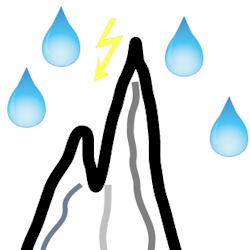

# Software &thinsp;&larr;&thinsp; _Creationg Drives_ ⚙️&thinsp;&#8610;&thinsp;🧪 Tests

<b>,TDD is easy .I started it over 100 times</b> <i>(Mark Twain</i> would say)

The hypothesis to write tests not only _a posteriori_ to validate available and running code but also prior &thinsp;&ndash;&thinsp; to guide development &thinsp;&ndash;&thinsp; can be rooted back to the **1950s**.👴

&nbsp; &nbsp; 👴 <samp>[You won't believe how old TDD is](https://arialdomartini.wordpress.com/2012/07/20/you-wont-believe-how-old-tdd-is/) offers a nice review.🔗.</samp>

**Tests make abstract matters tactile and feasible.** Simplicity and versatility make **TDD** superb for insight into fuzzy topics (almost any new application, novel development, or features). 

Tests are superconductors of design drives &thinsp;&ndash;&thinsp; domain, behavior, data, hardware model, &thinsp;&ndash;&thinsp; whatever. 
They can work in both directions: to code the tasks and to decode the existing functionality (also to find out bugs).

Sorry to interrupt this idyll narrative, but I can't help speaking about the next branching:

<table align="center"><tr><td>
  
<ins>&thinsp;TEST DRIVEN <b>DESIGN</b>&thinsp;</ins>

   
<mark><b>&thinsp;What to develop&thinsp;</b></mark>

  
TD<b>Δ</b>&nbsp;&nbsp;&nbsp;TDDe<b>S</b>&nbsp;&nbsp;&nbsp;🧪⚙️<b>Δ</b>

</td><td><h3 align="center">
  <a href="README+/TDD-Watershed/README.md"><picture></picture> 
    <ins>&thinsp;B&thinsp;I&thinsp;G&nbsp;&nbsp;&nbsp;W&thinsp;A&thinsp;T&thinsp;E&thinsp;R&thinsp;S&thinsp;H&thinsp;E&thinsp;D&thinsp;</b></ins></a>
</h3>
  </td><td>
  
<ins>&thinsp;TEST DRIVEN <b>DEVELOPMENT</b>&thinsp;</ins>

    
<mark><b>&thinsp;How to implement&thinsp;</b></mark>

  
TD<b>d</b>&nbsp;&nbsp;&nbsp;TDDe<b>V</b>&nbsp;&nbsp;&nbsp;🧪⚙️<b>δ</b>

  </td></tr></table>

___________\
🔚 🌙 2024-2026..
